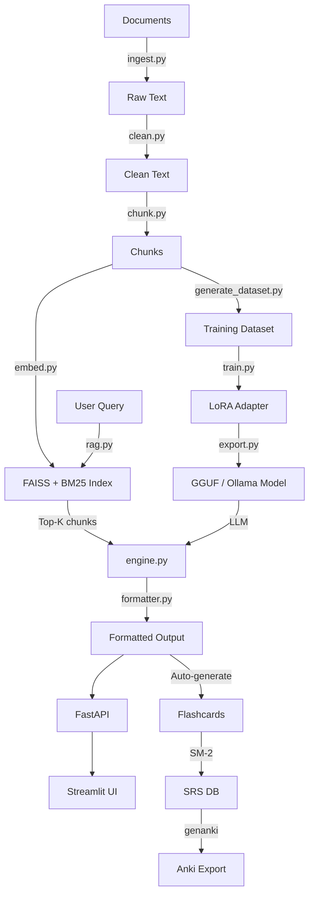

# Study Companion AI

A local-first, RAG-augmented study assistant with a full fine-tuning pipeline. Ingests your study materials, builds a searchable knowledge base, and generates structured study outputs using a fine-tuned Mistral-7B model served via Ollama.

**Not a chatbot wrapper** — this is a complete ML pipeline from data ingestion through model training to a production-ready API and UI.

## Quick Start (5 commands)

```bash
git clone <repo-url> && cd study-companion
bash scripts/setup_local.sh
bash scripts/run_pipeline.sh examples/sample_input.pdf
uvicorn api.main:app --port 8000 &
streamlit run ui/app.py
```

## Hardware Requirements

| Hardware | Model | Quantization | Training | Inference |
|----------|-------|-------------|----------|-----------|
| CPU only | Phi-3-mini | Q4_K_M (GGUF) | No | Slow |
| 8 GB VRAM | Mistral-7B-Instruct | Q4_K_M | QLoRA (batch=1) | Fast |
| 16 GB VRAM | Llama-3.1-8B | Q5_K_M | QLoRA comfortable | Fast |
| 24+ GB VRAM | Llama-3.1-70B | Q4_K_M | Full LoRA | Fast |
| Cloud A100 | Llama-3.1-70B | bf16 | Full fine-tune | Fast |

This project was developed on: **RTX 4060 Laptop (8GB VRAM), 16GB RAM, 24 CPU cores**.

## Features

### Study Output Modes
- **Simple Explanation** — ELI15 with analogies
- **Key Concepts** — Numbered definitions
- **Exam-Critical Points** — Must-remember facts/formulas
- **Detailed Explanation** — With worked examples
- **Common Mistakes** — Misconceptions and corrections
- **Practice Questions** — MCQ + short-answer + problem-solving
- **Revision Sheet** — Printable one-pager
- **Mnemonics** — Memory tricks and analogies
- **Concept Map** — Mermaid diagram of relationships

### Document Ingestion
PDF (text + OCR), DOCX, TXT, Markdown, images (OCR), web URLs, YouTube transcripts, pasted text.

### Domain-Aware Formatting
Auto-detects subject domain and applies appropriate formatting:
- **STEM**: LaTeX math blocks, formula sheets
- **Medicine**: Drug/condition tables, pathophysiology notes
- **Law**: Case citation format
- **Programming**: Code blocks with syntax highlighting
- **Humanities**: Timelines, argument structures
- **Languages**: Vocabulary tables

### Spaced Repetition
SM-2 algorithm with SQLite persistence. Export to Anki (.apkg) for mobile review.

## Training Commands

### Local (8GB+ VRAM)
```bash
# Generate dataset
bash scripts/run_pipeline.sh your_notes.pdf --with-dataset

# Train
python training/train.py --dataset data/dataset.jsonl

# Evaluate
python training/evaluate.py --dataset data/dataset.jsonl

# Export to Ollama
python training/export.py
```

### Cloud (Modal / RunPod)
```bash
bash scripts/train_cloud.sh data/dataset.jsonl
```

## Dataset Format

JSONL with one object per line:

```json
{
  "instruction": "Explain photosynthesis in simple terms.",
  "input": "Photosynthesis is the biological process by which green plants...",
  "output": "Think of photosynthesis like a solar-powered kitchen...",
  "metadata": {
    "source": "biology_ch3.pdf",
    "domain": "stem",
    "output_mode": "simple_explanation",
    "difficulty": "beginner",
    "chunk_id": "biology_ch3.pdf::chunk_0::a1b2c3d4"
  }
}
```

## Example Prompts

| Mode | Prompt |
|------|--------|
| Simple | "Explain photosynthesis in simple terms" |
| Key Concepts | "What are the key concepts in cellular respiration?" |
| Exam Critical | "What must I memorize about Newton's laws?" |
| Detailed | "Explain the Calvin Cycle in detail with examples" |
| Mistakes | "What do students commonly get wrong about evolution?" |
| Practice | "Generate quiz questions on SQL joins" |
| Revision | "Create a revision sheet for organic chemistry" |
| Mnemonics | "Memory tricks for the periodic table groups" |
| Concept Map | "Draw a concept map for machine learning" |

## API Endpoints

| Method | Path | Description |
|--------|------|-------------|
| POST | `/ingest` | Upload documents for processing |
| POST | `/generate` | Generate study material |
| POST | `/quiz/start` | Start a quiz session |
| POST | `/quiz/submit` | Submit quiz answers |
| GET | `/flashcards/due` | Get due flashcards |
| POST | `/flashcards/review` | Review a flashcard (SM-2) |
| GET | `/progress` | Study progress dashboard |
| GET | `/export/anki` | Download Anki .apkg deck |
| GET | `/health` | System health check |

Interactive docs: `http://localhost:8000/docs`

## Troubleshooting

### 1. `torch.cuda.is_available()` returns False
```bash
pip install torch --index-url https://download.pytorch.org/whl/cu126
```

### 2. `ModuleNotFoundError: No module named 'X'`
```bash
pip install -r requirements.txt
```

### 3. Ollama connection refused
```bash
# Start Ollama service
ollama serve
# Pull a model
ollama pull mistral
```

### 4. FAISS index not found
```bash
# Run the pipeline first
bash scripts/run_pipeline.sh examples/sample_input.pdf
```

### 5. Out of VRAM during training
Edit `training/configs/training_config.yaml`:
```yaml
per_device_train_batch_size: 1
gradient_accumulation_steps: 8
max_seq_length: 1024  # Reduce from 2048
```

## Architecture



## Bonus Features

- **Confidence Indicator** — Visual confidence bar based on retrieval quality (green/yellow/orange/red)
- **Auto-Flashcard Generation** — Automatically creates flashcards from definition patterns in study material
- **Study Streak Tracker** — Visual streak display to motivate daily study habits
- **Quick Mode Buttons** — One-click switching between study output modes
- **Topic Mastery Decay** — Recency-weighted mastery scoring that reflects real knowledge retention

## Project Structure

```
study-companion/
├── pipeline/          # Data ingestion, cleaning, chunking, embedding
├── training/          # LoRA fine-tuning, evaluation, GGUF export
├── inference/         # Ollama engine, hybrid RAG, domain formatter
├── api/               # FastAPI endpoints with Pydantic schemas
├── ui/                # Streamlit frontend
├── srs/               # SM-2 spaced repetition + Anki export
├── scripts/           # Setup, pipeline, demo, cloud training
├── tests/             # 38 tests covering ingest, chunk, RAG, API
├── examples/          # Sample PDF for testing
└── data/              # Runtime data (chunks, embeddings, DB)
```

## License

MIT
