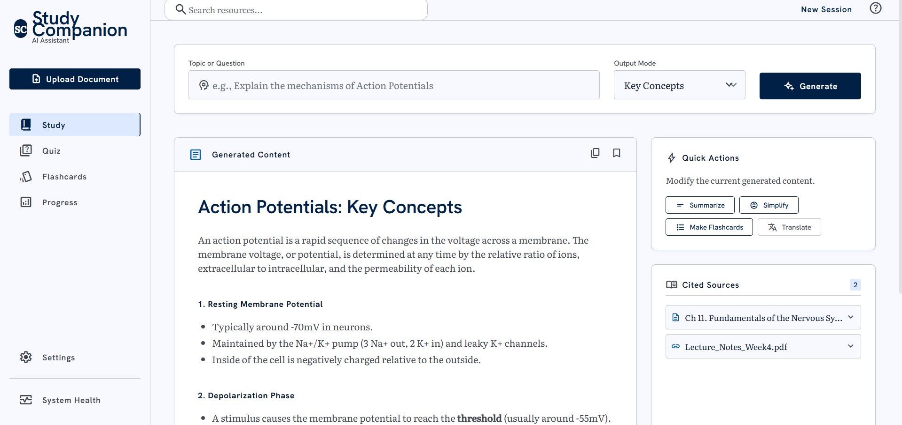
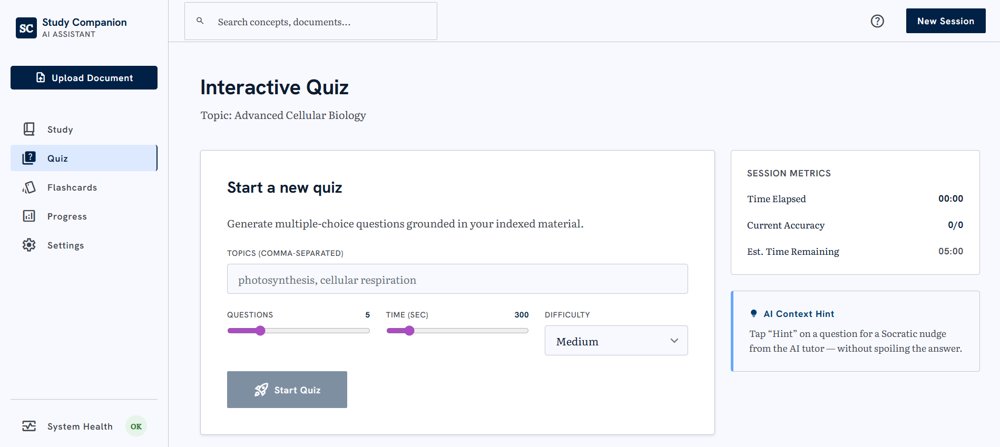
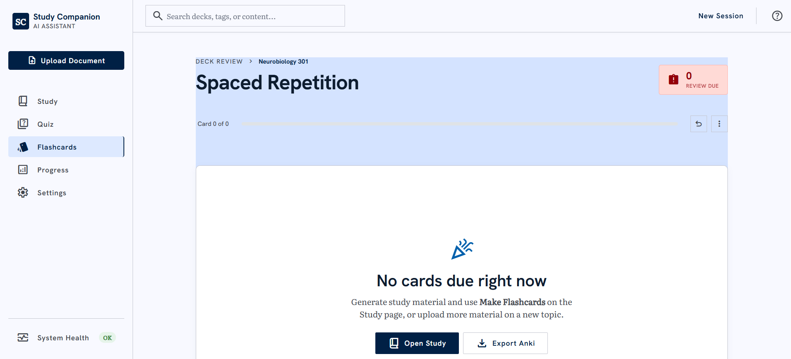
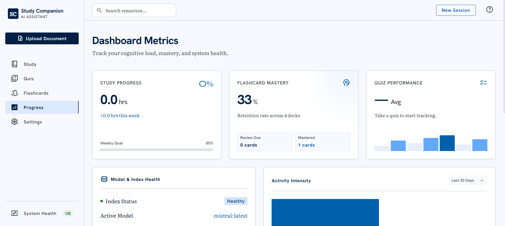
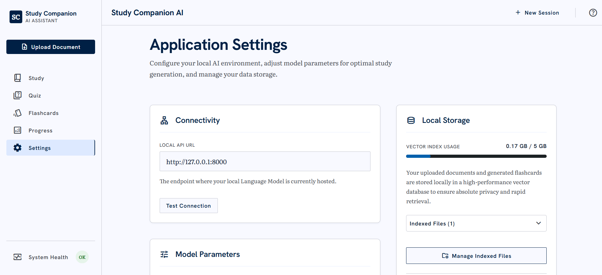
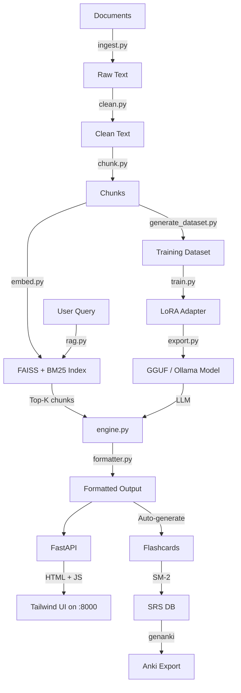

# Study Companion AI

A local-first, RAG-augmented study assistant with a full fine-tuning pipeline. Ingests your study materials, builds a searchable knowledge base, and generates structured study outputs using a fine-tuned Mistral-7B model served via Ollama. The frontend is a Tailwind-based single-page UI served directly by FastAPI.

**Not a chatbot wrapper** — this is a complete ML pipeline from data ingestion through model training to a production API and polished UI.

## Screenshots







## Quick Start

```bash
git clone <repo-url> && cd study-companion

# 1. Install dependencies
pip install -r requirements.txt

# 2. Pull the LLM (Ollama must be running)
ollama serve &
ollama pull mistral

# 3. Ingest sample material (optional)
bash scripts/run_pipeline.sh examples/sample_input.pdf

# 4. Start the app (API + UI on the same port)
uvicorn api.main:app --port 8000
```

Open **<http://localhost:8000>** in your browser.

### Windows (PowerShell)

```powershell
pip install -r requirements.txt
ollama serve   # in one terminal
ollama pull mistral
uvicorn api.main:app --port 8000
```

## How to Use

1. **Upload material** — Click *Upload Document* in the sidebar to drop in PDFs, DOCX, TXT, MD, images, or paste a URL. Files are chunked, embedded into FAISS + BM25, and stored locally.
2. **Study a topic** — On the Study page, type a topic and pick an Output Mode (Simple, Key Concepts, Exam Critical, Deep Dive, Mnemonics, Concept Map, etc.). Hit **Generate**.
3. **Refine with Quick Actions** — Summarize, Simplify, Elaborate, or Translate the current output. **Make Flashcards** extracts Q/A pairs and adds them to your deck.
4. **Quiz yourself** — On the Quiz page, list topics, pick difficulty/time/question count, then start. Use **Hint** (Socratic nudge from the LLM) and **Flag for Review**. Submit to see per-question grading and weak-topic detection.
5. **Spaced repetition** — Flashcards page surfaces due cards. Rate **Again / Hard / Good / Easy** (SM-2). Keyboard shortcuts: `Space` to reveal, `1`–`4` to rate.
6. **Track progress** — Progress page shows total study hours, weekly goal %, flashcard retention, letter-grade quiz average, 30-day activity heatmap, topic mastery, and recent sessions.
7. **Settings** — Test API connection, tune Top-K and Temperature, browse indexed files, clear the index, manage bookmarks.

## Hardware Requirements

| Hardware | Model | Quantization | Training | Inference |
|----------|-------|-------------|----------|-----------|
| CPU only | Phi-3-mini | Q4_K_M (GGUF) | No | Slow |
| 8 GB VRAM | Mistral-7B-Instruct | Q4_K_M | QLoRA (batch=1) | Fast |
| 16 GB VRAM | Llama-3.1-8B | Q5_K_M | QLoRA comfortable | Fast |
| 24+ GB VRAM | Llama-3.1-70B | Q4_K_M | Full LoRA | Fast |
| Cloud A100 | Llama-3.1-70B | bf16 | Full fine-tune | Fast |

Developed on: **RTX 4060 Laptop (8 GB VRAM), 16 GB RAM, 24 CPU cores**.

## Features

### Study Output Modes
- **Simple Explanation** — ELI15 with analogies
- **Key Concepts** — Numbered definitions
- **Exam-Critical Points** — Must-remember facts/formulas
- **Detailed Explanation** — With worked examples
- **Common Mistakes** — Misconceptions and corrections
- **Practice Questions** — MCQ + short-answer + problem-solving
- **Revision Sheet** — Printable one-pager
- **Mnemonics** — Memory tricks and analogies
- **Concept Map** — Mermaid diagram of relationships

### Quick Actions (post-generation)
Summarize · Simplify · Elaborate · Translate · Make Flashcards · Copy as Markdown · Bookmark

### Document Ingestion
PDF (text + OCR), DOCX, TXT, Markdown, images (OCR), web URLs, YouTube transcripts, pasted text.

### Domain-Aware Formatting
Auto-detects subject domain and applies appropriate formatting:
- **STEM** — LaTeX math blocks, formula sheets
- **Medicine** — Drug/condition tables, pathophysiology notes
- **Law** — Case citation format
- **Programming** — Code blocks with syntax highlighting
- **Humanities** — Timelines, argument structures
- **Languages** — Vocabulary tables

### Spaced Repetition
SM-2 algorithm with SQLite persistence. Undo last review, export to Anki (.apkg) for mobile.

### Quiz Mode
LLM-generated MCQs grounded in your material, AI hints, flag-for-review, session timer, per-topic mastery scoring.

### Progress Dashboard
Bento-grid metrics: study hours, weekly goal, flashcard retention, quiz letter grade, 30-day activity heatmap with hover tooltips, recent-sessions log with impact scores.

## Training Commands

### Local (8GB+ VRAM)
```bash
bash scripts/run_pipeline.sh your_notes.pdf --with-dataset
python training/train.py    --dataset data/dataset.jsonl
python training/evaluate.py --dataset data/dataset.jsonl
python training/export.py
```

### Cloud (Modal / RunPod)
```bash
bash scripts/train_cloud.sh data/dataset.jsonl
```

## Dataset Format

JSONL, one object per line:

```json
{
  "instruction": "Explain photosynthesis in simple terms.",
  "input": "Photosynthesis is the biological process by which green plants...",
  "output": "Think of photosynthesis like a solar-powered kitchen...",
  "metadata": {
    "source": "biology_ch3.pdf",
    "domain": "stem",
    "output_mode": "simple_explanation",
    "difficulty": "beginner",
    "chunk_id": "biology_ch3.pdf::chunk_0::a1b2c3d4"
  }
}
```

## API Endpoints

Interactive docs: <http://localhost:8000/docs>

### Pages (HTML)
| Path | Page |
|------|------|
| `/` | Study |
| `/quiz` | Quiz |
| `/flashcards` | Flashcards |
| `/progress-page` | Progress dashboard |
| `/settings` | Settings |

### Core API (JSON)
| Method | Path | Description |
|--------|------|-------------|
| POST | `/ingest` | Upload documents and/or URLs for indexing |
| POST | `/generate` | RAG-grounded study material generation |
| POST | `/generate/refine` | Apply quick action (summarize / simplify / elaborate / translate) |
| POST | `/quiz/start` | Start a quiz session with generated MCQs |
| POST | `/quiz/submit` | Submit answers, get grading and weak-topic detection |
| POST | `/quiz/hint` | Socratic hint for a question (no spoilers) |
| POST | `/quiz/flag` | Flag/unflag a question for review |
| GET | `/flashcards/due` | Cards due for review |
| POST | `/flashcards/review` | Record a SM-2 review |
| POST | `/flashcards/from-text` | Extract Q/A flashcards from arbitrary text |
| POST | `/flashcards/undo` | Undo the last review for a card |
| GET | `/progress` | Per-topic mastery |
| GET | `/dashboard` | Aggregated metrics (hours, retention, letter grade) |
| GET | `/sessions/recent` | Recent study sessions |
| POST | `/sessions` | Log a session |
| GET | `/activity/heatmap` | Daily activity counts |
| GET | `/export/anki` | Anki `.apkg` download |
| GET | `/search` | Cross-source search (chunks + flashcards) |
| GET | `/index/files` | List indexed sources with chunk counts |
| DELETE | `/index` | Clear the knowledge index |
| GET / POST / DELETE | `/bookmarks` | Saved generated outputs |
| GET | `/health` | System health |

## Configuration (env vars)

| Variable | Default | Purpose |
|----------|---------|---------|
| `OLLAMA_URL` | `http://localhost:11434` | Ollama endpoint |
| `OLLAMA_MODEL` | `mistral:latest` | Generation model |
| `RAG_TOP_K` | `5` | Default chunks retrieved |
| `RAG_ALPHA` | `0.7` | Dense vs sparse weight (1 = pure FAISS) |
| `RELEVANCE_THRESHOLD` | `0.35` | Below this, mark output as uncertain |
| `GROUNDING_THRESHOLD` | `0.6` | Per-sentence grounding ratio |
| `SRS_DB_PATH` | `data/srs.db` | SQLite path |
| `WEEKLY_GOAL_HOURS` | `10` | Weekly study target |
| `STUDY_COMPANION_CORS_ORIGINS` | `http://localhost:8000,http://127.0.0.1:8000` | CORS allowlist |

## Troubleshooting

**`torch.cuda.is_available()` returns False**
```bash
pip install torch --index-url https://download.pytorch.org/whl/cu126
```

**`ModuleNotFoundError: No module named 'X'`**
```bash
pip install -r requirements.txt
```

**Ollama connection refused**
```bash
ollama serve
ollama pull mistral
```

**FAISS index not found** — happens before any ingestion. Upload material from the sidebar or run:
```bash
bash scripts/run_pipeline.sh examples/sample_input.pdf
```

**Out of VRAM during training** — edit `training/configs/training_config.yaml`:
```yaml
per_device_train_batch_size: 1
gradient_accumulation_steps: 8
max_seq_length: 1024
```

**UI loads but data is empty** — check the **System Health** panel in the sidebar; "Down" means the Ollama backend isn't reachable. Confirm with `curl http://localhost:11434/api/tags`.

## Architecture



## Project Structure

```
study-companion/
├── pipeline/          # Data ingestion, cleaning, chunking, embedding
├── training/          # LoRA fine-tuning, evaluation, GGUF export
├── inference/         # Ollama engine, hybrid RAG, domain formatter
├── api/               # FastAPI endpoints + Pydantic schemas (also serves the UI)
├── web/               # Frontend (HTML + Tailwind + vanilla JS)
│   ├── index.html             Study
│   ├── quiz.html              Quiz
│   ├── flashcards.html        Flashcards
│   ├── progress.html          Progress dashboard
│   ├── settings.html          Settings
│   └── static/                theme.js, styles.css, shell.js, api.js + per-page JS
├── srs/               # SM-2 spaced repetition + Anki export
├── scripts/           # Setup, pipeline, demo, cloud training
├── tests/             # 38 tests covering ingest, chunk, RAG, API
├── examples/          # Sample PDF for testing
├── docs/screenshots/  # README screenshots live here
└── data/              # Runtime data (chunks, embeddings, DB)
```

## Security

Pre-publish security review summary:
- Filename sanitization on `/ingest` prevents path traversal (`Path.name` + extension allowlist + `resolve()`-bounded write under `data/raw/`).
- CORS restricted to local origins (`http://localhost:8000`); credentials disabled.
- URL ingestion requires `http(s)://` scheme.
- `pickle.load` is used on index artifacts under `data/embeddings/` — keep that directory trusted; do not load index packs from untrusted sources.

## License

MIT
